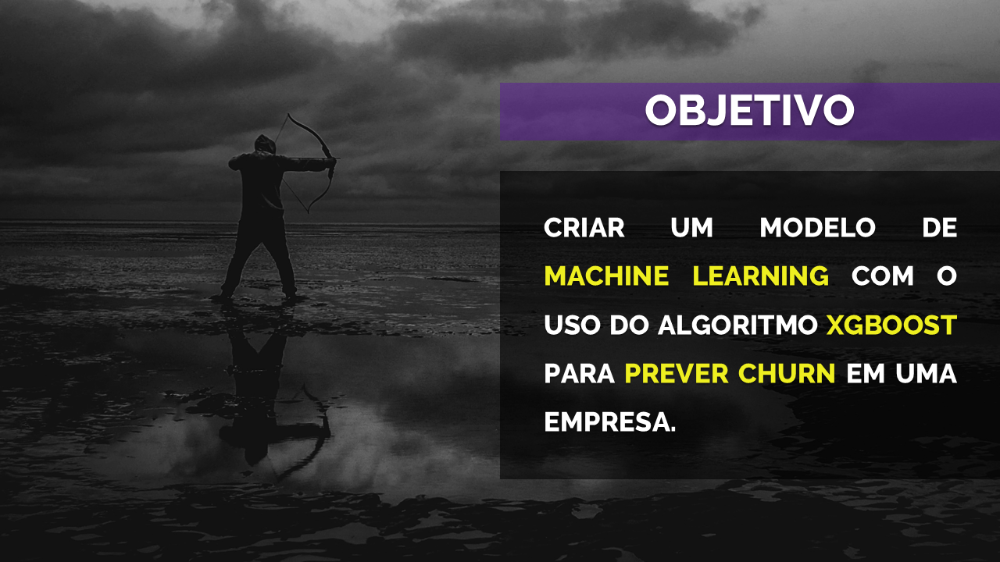
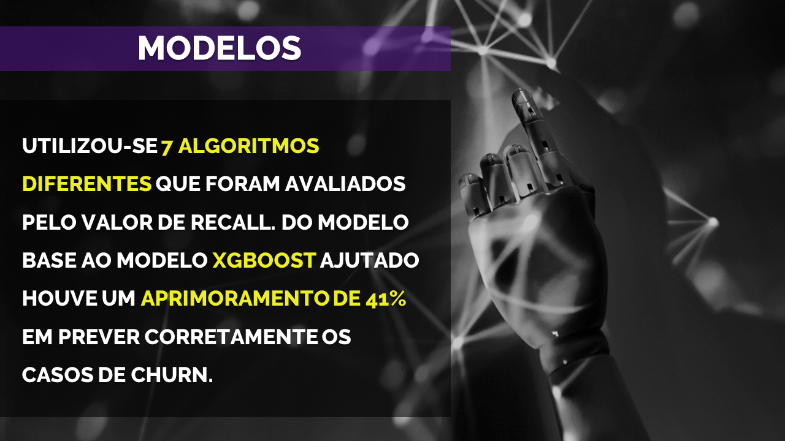
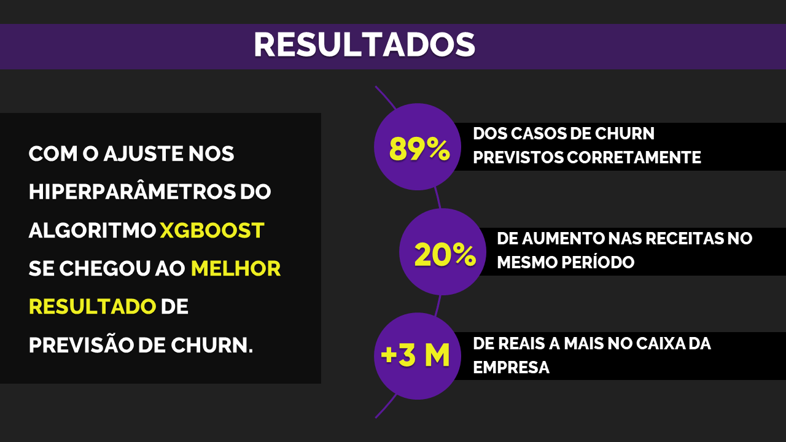

# Previsão de Churn

⚠️Em construção - O projeto completo será publicado em 5 de Setembro de 2023⚠️

 _Click [here](https://github.com/raffaloffredo/churn_prediction) to English-EN_   
 

  

 

## Sobre o projeto
O objetivo principal de desse estudo foi criar um modelo de _machine learning_ com o uso do algoritmo _XGBoost_ para prever _churn_ em uma empresa de telecomunicações. Para isso, foi realizada um análise exloratória, a fim de conhecer o conjunto de dados e extrair _insights_ que pudessem auxiliar as etapas seguintes do projeto. Também, foram criados 7 modelos com diferentes algoritmos que foram avaliados pelo valor de Recall obtido. Por fim, fiz o ajuste dos hiperparâmetros do XGBoost para obter uma melhor performance do modelo e, ainda, apliquei engenharia de atributos para tentar aprimorar ainda mais a previsão de churn.

* **[Projeto na íntegra]()**
* **[Artigo Completo]()**
* **[Artigo Resumido (Resultados)]()**
 

## Material Extra
Os resultados obtidos com o modelo XGBoost foram condensados em imagens para gerar uma apresentação direta do que a empresa poderia alcançar com o uso dessa ferramenta.

  

 

  

 

  

 

  

 

## Outros projetos

* **[Detecção de fraude em cartão de crédito](https://github.com/raffaloffredo/fraud_detection_portuguese)**
* **[Airbnb New York](https://github.com/raffaloffredo/airbnb_new_york_portuguese)**
* **[Estudo atualizado sobre COVID-19 no Brasil e no mundo](https://github.com/raffaloffredo/covid_2023_portuguese)**
 

 ## Contatos

  
  
  
  
  

